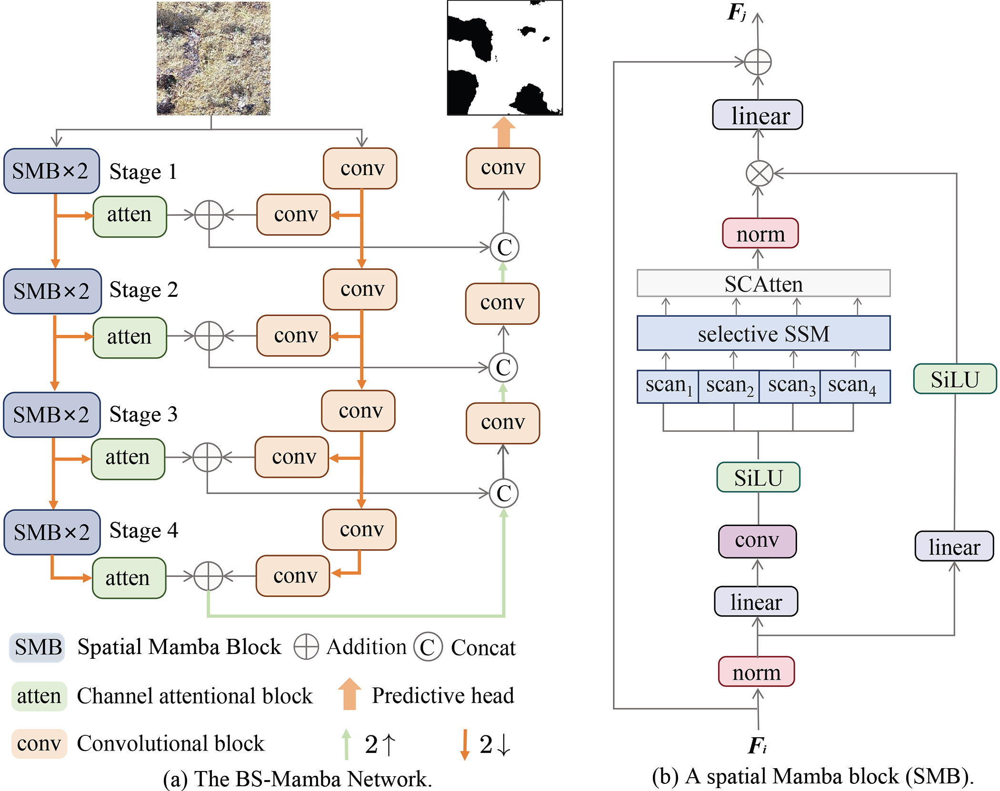

# BS-Mamba for Black-Soil Area Detection on the Qinghai-Tibetan Plateau
Extremely degraded grassland on the Qinghai-Tibetan Plateau (QTP) presents a significant environmental challenge due to overgrazing, climate change, and rodent activity, which degrade vegetation cover and soil quality. These extremely degraded grassland on QTP, commonly referred to as black-soil area, require accurate assessment to guide effective restoration efforts. In this paper, we present a newly created QTP black-soil dataset, annotated under expert guidance. We introduce a novel neural network model, BS-Mamba, specifically designed for the black-soil area detection using UAV remote sensing imagery. The BS-Mamba model demonstrates higher accuracy in identifying black-soil area across two independent test datasets than the state-of-the-art models. This research contributes to grassland restoration by providing an efficient method for assessing the extent of black-soil area on the QTP.



# Experiment
## Train BS-QTP dataset
```sh
python train.py
```

## Test two datasets
```sh
python test.py
```

# Citation
We appreciate it if you cite the following paper:
```
@Article{maxjars2025,
  author  = {Xuan Ma and Zewen Lv and Chengcai Ma and Tao Zhang and Yuelan Xin and Kun Zhan},
  journal = {Journal of Applied Remote Sensing},
  title   = {BS-Mamba for Black-Soil Area Detection on the Qinghai-Tibetan Plateau},
  year    = {2025},
}
```

# Contact
https://kunzhan.github.io/

If you have any questions, feel free to contact me. (Email: `ice.echo#gmail.com`)
